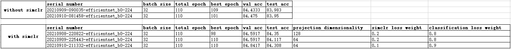
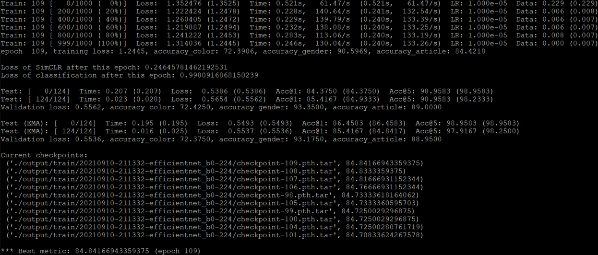
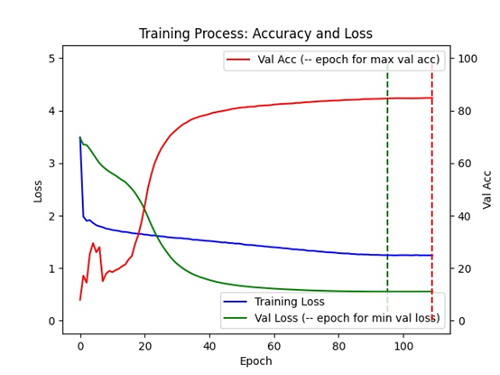
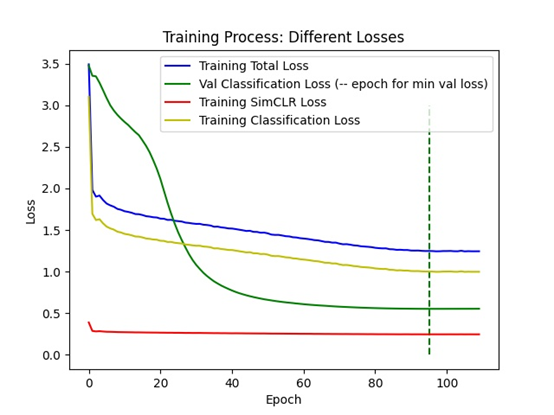

# PyTorch Image Models With SimCLR
Multi-label classification based on timm, and add [SimCLR](https://arxiv.org/abs/2002.05709) to timm.

## Introduction
This repository is used for (multi-label) classification. <br>
The code is based on another repo on mine [PyTorch Image Models Multi Label Classification](https://github.com/yang-ruixin/PyTorch-Image-Models-Multi-Label-Classification), which further based on [Pytorch Image Models by Ross Wightman](https://github.com/rwightman/pytorch-image-models). <br>
Thank Ross for his great work.

The loss function NT_Xent defined in folder ./simclr is from [Spijkervet/SimCLR](https://github.com/Spijkervet/SimCLR). Thank Janne Spijkervet. <br>
The main reference for multi-label classification is [this website](https://learnopencv.com/multi-label-image-classification-with-pytorch/). Thank Dmitry Retinskiy and Satya Mallick. <br>
For the purpose of understanding our context and the dataset, please spend 5 minutes on reading the [link](https://learnopencv.com/multi-label-image-classification-with-pytorch/), though you don’t need to read the specific code there. <br>
[Here is the link to download the images.](https://www.kaggle.com/paramaggarwal/fashion-product-images-small) <br>
Put all the images into ./fashion-product-images/images/.

In order to add SimCLR, I modify the following files from [PyTorch Image Models Multi Label Classification](https://github.com/yang-ruixin/PyTorch-Image-Models-Multi-Label-Classification):
1.  ./train.py
2.  ./validate.py
3.  ./timm/data/dataset.py
4.  ./timm/data/loader.py
5.  ./timm/models/multi_label_model.py
6.  ./timm/utils/summary.py

**In order to train your own dataset, you only need to modify the 1, 2, 3, 5 files.** <br>
Simply modify the code between the double dashed lines, or search color/gender/article, that’s the code/label that you need to change. <br>
Note that I only modified EfficientNets, so if you want to use other backbones, please see the [README](https://github.com/yang-ruixin/PyTorch-Image-Models-Multi-Label-Classification) there and modify the code yourself.

## Methods
I use semi-supervised learning - contrastive learning - SimCLR in this repo during the training process to improve the model performance. <br>
In the paper, the authors train unlabelled data first, and fine-tune the whole learned model using few labelled data. They freeze the learned model, and train a linear or non-linear classifier on top of it using labelled dataset. <br>
But here, I train the model with two losses at the same time: <br>
loss = simclr_loss * simclr_loss_weight + classification_loss * classification_loss_weight

## Experiments

In this example, you can see that the models with SimCLR are consistently better than the models without SimCLR, for both validation and test datasets. 
Also, projection output dimensionality doesn’t matter a lot, 128 or 64, or even 32 would not make a big difference.
Giving SimCLR loss weight 0.1 is better than 0.2 in this example. <br>
According to the paper, SimCLR benefits from larger batch sizes and more training steps.
My batch size was only 32, and I only trained 110 epochs in this toy example. Try larger numbers during your real work. <br>

The training process of experiment 20210910-211332-efficientnet_b0-224 is shown below as an example: <br>
 <br>
 <br>
 <br>
In case you have a large amount of unlabelled data, do what the paper says, train SimCLR first, and then train a classifier, which means you could learn from few labelled data.

## Command Example
Here is a command example to start to train: <br>
```
./distributed_train.sh 1 ./fashion-product-images/ --model efficientnet_b0 -b 32 --sched cosine --epochs 100 --decay-epochs 2.4 --decay-rate .97 --opt adamp --opt-eps .001 -j 8 --warmup-lr 1e-6 --weight-decay 1e-5 --drop 0.3 --drop-connect 0.2 --model-ema --model-ema-decay 0.9999 --aa rand-m9-mstd0.5 --remode pixel --reprob 0.2 --amp --lr .016 --pretrained -wls 0.1 -wlc 0.9  
```
And a command example to start to validate: <br>
```
python validate.py ./fashion-product-images/ --model efficientnet_b0 --checkpoint ./output/train/YOUR_SPECIFIC_FOLDER/model_best.pth.tar -b 32  
```
Please give a star if you find this repo helpful.

## License
This project is released under the Apache License, Version 2.0.

## Citation (BibTeX)
```
@misc{yrx2021simclr,
  author = {YANG Ruixin},
  title = {PyTorch Image Models With SimCLR},
  year = {2021},
  publisher = {GitHub}
}
```
